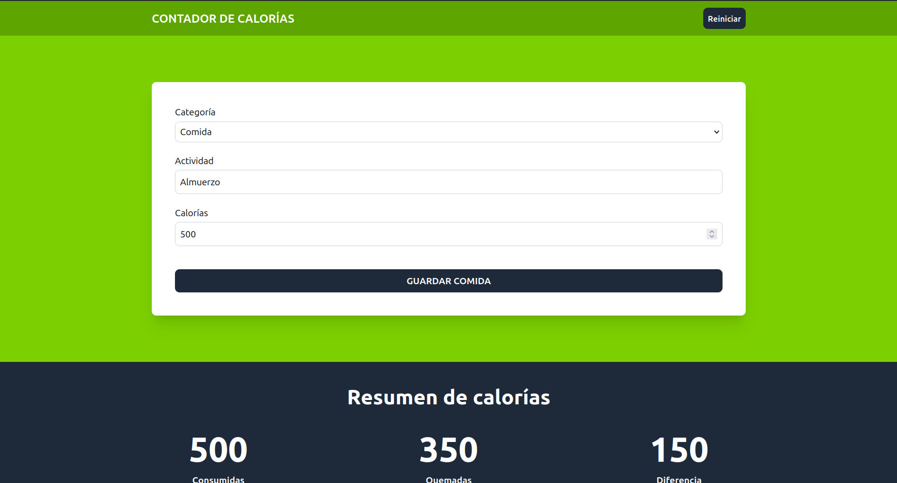

# 🍎 Calorie Tracker -- React & TypeScript

This project was developed as part of the React & TypeScript -- La Guía
Completa course by Juan de la Torre (Udemy).

Calorie Tracker is a fully functional web application designed to
monitor calorie intake and expenditure in a structured and intuitive
way. The application emphasizes advanced state management patterns,
strong type safety with TypeScript, and a modern responsive UI built
with Tailwind CSS.

------------------------------------------------------------------------

## 🚀 Features

### 🔹 Activity Tracking

Easily log food consumption and physical activities, each with a
specific calorie value.

### 🔹 Advanced State Management

Implements the `useReducer` hook to handle complex state transitions
such as: 
- Adding activities 
- Editing entries 
- Deleting records

### 🔹 Data Persistence

All activity data is automatically stored in **localStorage**, ensuring
persistence even after refreshing or closing the browser.

### 🔹 Real-Time Calorie Summary

Live calculations for:
- Total calories consumed
- Total calories burned 
- Net calorie balance

### 🔹 Form Validation

Dynamic form validation prevents incomplete or invalid entries before
submission.

### 🔹 Responsive Design

Built with a **mobile-first approach** using Tailwind CSS to ensure a
seamless experience across all devices.

------------------------------------------------------------------------

## 🧠 Key Concepts Practiced

-   Advanced React Hooks (`useReducer`, `useMemo`, `useEffect`)
-   Centralized state logic with Reducers and typed Actions
-   Type-safe development using TypeScript interfaces and custom types
-   Persistent state handling with localStorage integration
-   Modular and scalable component architecture
-   Efficient array operations (`map`, `filter`, `reduce`)

------------------------------------------------------------------------

## 🛠️ Technologies Used

-   React 19
-   Vite
-   TypeScript
-   Tailwind CSS
-   Heroicons
-   UUID (for unique activity identifiers)

------------------------------------------------------------------------

## 🧩 Project Structure

``` bash
calorie-tracker/
├── src/
│   ├── components/       # Reusable UI components (Form, List, Tracker, etc.)
│   ├── data/             # Static configuration and categories
│   ├── reducers/         # Reducer logic and state definitions
│   ├── types/            # TypeScript interfaces and type definitions
│   ├── App.tsx           # Root application component
│   ├── main.tsx          # Application entry point
│   └── index.css         # Global styles & Tailwind directives
├── public/               # Static assets
├── index.html            # HTML template
├── package.json          # Dependencies and scripts
└── vite.config.ts        # Vite configuration
```

------------------------------------------------------------------------

## ⚙️ Installation & Setup

1.  Clone the repository:

``` bash
git clone https://github.com/lorelvis-santos/calorie-tracker.git
```

2.  Navigate into the project folder:

``` bash
cd calorie-tracker
```

3.  Install dependencies:

``` bash
npm install
# or
pnpm install
```

4.  Start the development server:

``` bash
npm run dev
```

The application will be available at:

    http://localhost:5173

------------------------------------------------------------------------

## 📸 Preview

__

------------------------------------------------------------------------

## 📚 Credits

This project was developed as part of the React & TypeScript course by
Juan de la Torre and adapted for educational and portfolio purposes.

------------------------------------------------------------------------

## 📝 License

This project is intended for educational use only and is not licensed
for commercial distribution.